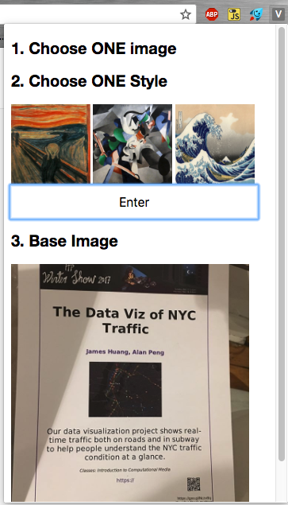
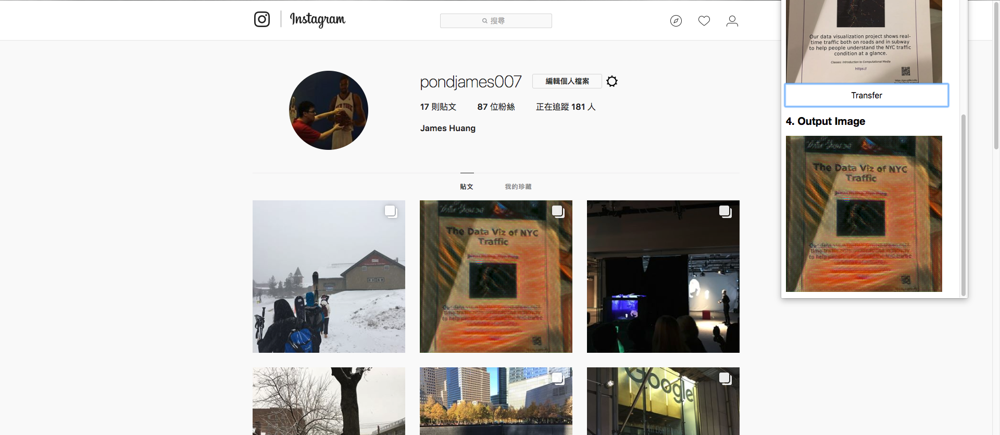
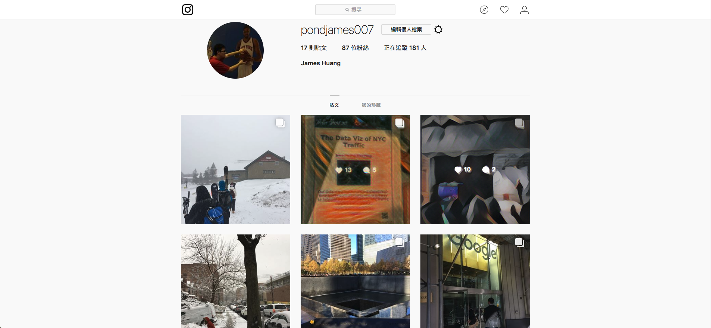

# Style Transfer Chrome Extension
A Chrome Extension to apply **Style Transfer** on Instagram Photos

## Style Transfer Training
* Follow this [Fast Style Transfer in Tensorflow](https://github.com/lengstrom/fast-style-transfer) to train your own model.
* Use the provided Style Transfer model in [Runway ML](https://runwayml.com/).

## Applying Style Transfer
Use [ml5js](https://ml5js.org/) to apply Style Transfer in Javascript for web-related applications

## Chrome Extension
To get the image data from Instagram, there is a cross-origin data issue due to network security, so I have to find other approaches to get the image data.

### Version 1: Download Image
I tried to download the image I chose so that the image I am going to deal with will become a local data. At first I thought the extension will pack all images onto chrome so the web accessible resources (images) will be also unchangeable. Luckily it seems that it will still change if I download the image to my extension folder.

	

	

### Version 2: Backstage Processing
I tried to get the screenshot of the page and cut the part I want (which is the image I clicked). So this time I send the image to background to do style transfer. At first I thought doing style transfer in background won’t slow down the user doing things at front. However, it seems that it will slow down the whole browser. Fortunately, the image is not that large, so it only takes few seconds. 

	

